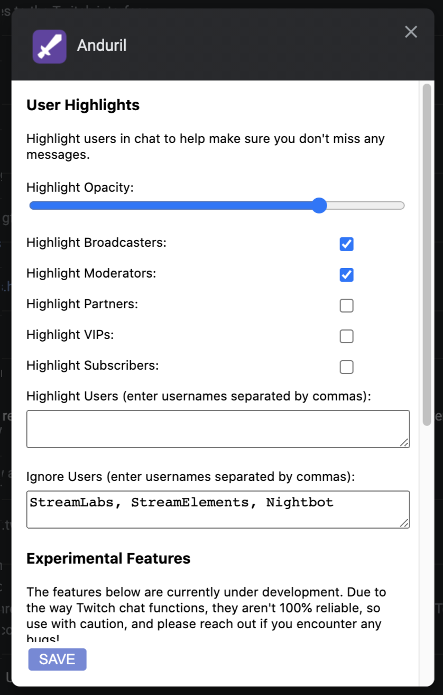

<h2 align="center">Anduril</h2>

A Chrome extension which adds useful features to the Twitch UI, aimed at moderators and streamers.

    <a href="#why">Why?</a>
    ·
    <a href="#installation">Installation</a>
    ·
    <a href="#features">Features</a>
    ·
    <a href="#comparison">Comparison</a>
    ·
    <a href="#suggestions-and-contributions">Suggestions & Contributions</a>

## Why?

As each Twitch community grows, it becomes increasingly difficult to manage. The chat in particular can become hard to follow, and important messages quickly get lost in the deluge of messages. Anduril adds features to the Twitch user interface designed to help streamers and moderators keep up!

No guarantees that features will always work - when Twitch makes updates, this extension may break. If you find any bugs, please open an issue.

## Installation

Anduril is currently only available as a Chrome extension.

[Install the Chrome extension via the webstore!](https://chrome.google.com/webstore/detail/anduril/hilmmmfdfaflmanloccldjiokgafaiaa)

## Features

All major features are customisable via the extension's settings page. To edit these settings:

-   Navigate to [chrome://extensions](chrome://extensions)
-   Find the `Anduril` extension and click the associated <kbd>Details</kbd> button
-   Scroll down the page and click the <kbd>Extension Options</kbd> button towards the bottom of the list
-   Edit the settings in the modal
-   Click the <kbd>save</kbd> button

#### User Highlights

Highlight users in chat to help make sure you don't miss any messages.

###### Highlight Opacity

Customises how visible the user highlight is.

###### Highlight Broadcasters

Toggles the highlight for channel broadcasters.

###### Highlight Moderators

Toggles the highlight for channel moderators.

###### Highlight Partners

Toggles the highlight for Twitch partners.

###### Highlight VIPs

Toggles the highlight for channel VIPs.

###### Highlight Subscribers

Toggles the highlight for channel subscribers.

###### Highlight Users

Adds a list of users to always highlight, regardless of whether they fall into any of the above categories.

###### Ignore Users

Adds a list of users to never highlight, regardless of whether they fall into any of the above categories.

#### User Notes

Add notes to users which are displayed next to their username in chat. Useful to keep track of users' preferred pronouns or nicknames!

#### Chat Filters

Add filters to the chat which show/hide messages from different categories of user. Makes it easier to focus on the messages you need to see without preventing viewers from talking.

## Suggestions and Contributions

Suggestions and pull requests are highly encouraged!

If you have an idea for a feature, open up an [issue](https://github.com/jtmcgrath/anduril/issues). If you're interested in contributing, take a look at the [contributing guidelines](./CONTRIBUTING.md).

## License

[MIT](./LICENSE)
